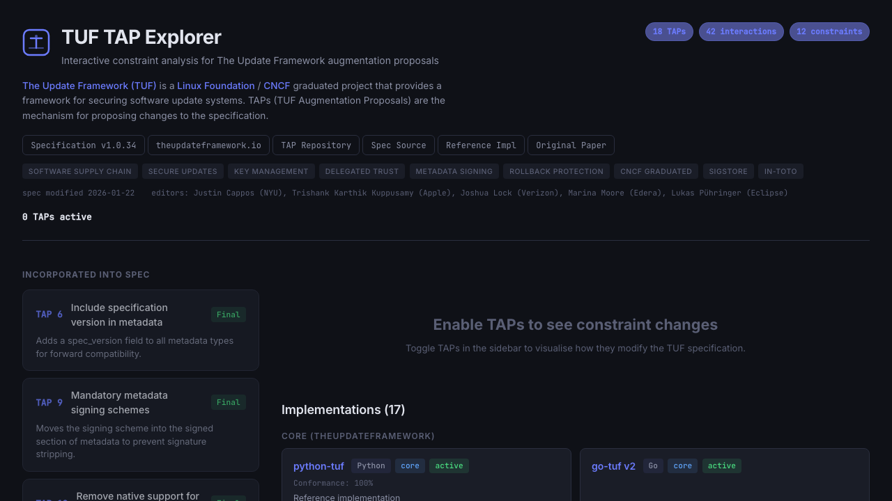

# TUF Spec Explorer

An interactive single-page application for exploring how [TUF Augmentation Proposals (TAPs)](https://github.com/theupdateframework/taps) modify the constraints defined by [The Update Framework (TUF) specification](https://theupdateframework.github.io/specification/latest/).



Toggle any combination of 14 TAPs and see how the spec constraints change, which TAPs interact (synergies, tensions, conflicts), dependency warnings, security impacts, and implementation coverage across 17 TUF client libraries — all computed in real time. The sidebar also lists 4 TAPs already incorporated into the spec (TAPs 6, 9, 10, 11).

## Building and Running Locally

**Prerequisites:** Node.js (v18+) and npm.

```bash
# Install dependencies
npm install

# Start the dev server (with hot reload)
npm run dev

# Or build for production
npm run build

# Preview the production build
npm run preview
```

The dev server runs at `http://localhost:5173` by default.

## Tech Stack

- **React 19** with TypeScript 5.7
- **Vite 6** for bundling and dev server
- Plain CSS with custom properties for theming

---

## Appendix: Data Model

All TAP and constraint data lives in [`src/tuf-spec-data.json`](src/tuf-spec-data.json). The TypeScript interfaces are defined in [`src/types.ts`](src/types.ts).

### Top-Level Structure

```
SpecData
├── spec              # Base TUF spec metadata (v1.0.34)
│   ├── roles         # root, targets, snapshot, timestamp
│   ├── attacks[]     # Attacks TUF mitigates
│   └── constraints{} # 12 base spec constraints (C-KEYID, C-DELEG, etc.)
├── incorporatedTaps  # 4 TAPs already merged into the spec (6, 9, 10, 11)
├── taps[]            # 14 toggleable TAPs with constraint changes and security impacts
├── tapInteractions[] # 42 cross-TAP interactions (synergies, tensions, conflicts, compounds)
├── implementations[] # TUF client libraries with TAP support tracking
└── processTaps[]     # Process-oriented TAPs (1, 2) not modeled as constraint changes
```

### Key Entities

**Tap** — A single TAP with its status, dependencies, constraint changes, and security impact.

| Field | Description |
|---|---|
| `tap` | TAP number |
| `status` | `Accepted`, `Draft`, `Rejected`, or `Deferred` |
| `dependencies` | TAP numbers this TAP depends on |
| `requiresMajorBump` | Whether adoption requires a spec v2.x |
| `constraintChanges[]` | How this TAP adds, removes, or relaxes constraints |
| `securityImpact` | What attacks are mitigated and how |

**Constraint** — A base TUF spec constraint (e.g. `C-DELEG`, `C-THRESH`).

| Field | Description |
|---|---|
| `id` | Identifier like `C-KEYID` |
| `description` | Full constraint text |
| `specSection` | Section in the TUF spec (e.g. `4.2`) |

**ConstraintChange** — How a TAP modifies a constraint.

| Field | Description |
|---|---|
| `type` | `added`, `removed`, or `relaxed` |
| `constraintId` | Which constraint is affected |
| `before` / `after` | The constraint text before and after the change |

**TapInteraction** — An emergent effect when two or more TAPs are active together.

| Field | Description |
|---|---|
| `taps` | Array of 2–4 TAP numbers involved |
| `type` | `synergy`, `tension`, `conflict`, or `compound` |
| `severity` | `info`, `warning`, or `breaking` |
| `constraintEffects[]` | Additional constraint changes caused by the interaction |

There are 42 interactions total: 11 synergies, 20 tensions, 2 conflicts, and 9 compound effects. Compound effects involve 3+ TAPs and capture emergent behaviour (e.g. the "AND-delegation ratchet" from TAPs 3+8+20).

**Implementation** — A TUF client library with its TAP support matrix.

| Field | Description |
|---|---|
| `id` | Unique identifier (e.g. `python-tuf`) |
| `name` | Display name |
| `language` | Implementation language |
| `githubUrl` | Link to the GitHub repository |
| `status` | `active`, `pre-production`, `alpha`, or `archived` |
| `tier` | `core` (theupdateframework org), `third-party`, `sigstore`, or `system` |
| `specVersion` | TUF spec version targeted |
| `conformancePercent` | Optional conformance test pass rate |
| `tapSupport[]` | Array of `{ tap, level, notes? }` — which TAPs are supported and at what level (`full` or `partial`) |
| `notes` | Optional description |

Implementations are grouped by tier in the UI. When TAPs are toggled, each implementation card shows which active TAPs it supports (green) or doesn't (red), and the summary bar reports how many implementations fully cover the selected TAP combination.

### Constraint Resolution

When TAPs are toggled in the UI, constraints are resolved as follows:

1. Start with the 12 base spec constraints (all `unchanged`).
2. Apply each active TAP's `constraintChanges` — status becomes `modified`, `removed`, or `new`.
3. Apply any `constraintEffects` from active interactions.
4. Flag dependency violations and incompatibilities.
5. Compute implementation coverage — for each implementation, check its `tapSupport` against the active TAPs.

### Resources Used to Generate the Data Model

The data model was constructed by analyzing the following primary sources:

- [TUF Specification v1.0.34](https://theupdateframework.github.io/specification/latest/) — the base constraints and role definitions
- [TAP repository](https://github.com/theupdateframework/taps) — individual TAP documents:
  - [TAP 3](https://github.com/theupdateframework/taps/blob/master/tap3.md) — Multi-role Delegations
  - [TAP 4](https://github.com/theupdateframework/taps/blob/master/tap4.md) — Multiple Repository Consensus
  - [TAP 5](https://github.com/theupdateframework/taps/blob/master/tap5.md) — Setting URLs for Roles on Repositories
  - [TAP 7](https://github.com/theupdateframework/taps/blob/master/tap7.md) — Conformance Testing
  - [TAP 8](https://github.com/theupdateframework/taps/blob/master/tap8.md) — Key Rotation via Root
  - [TAP 12](https://github.com/theupdateframework/taps/blob/master/tap12.md) — Improving Delegation
  - [TAP 13](https://github.com/theupdateframework/taps/blob/master/tap13.md) — User Selection of Top-Level Targets
  - [TAP 14](https://github.com/theupdateframework/taps/blob/master/tap14.md) — Managing TUF Versions
  - [TAP 15](https://github.com/theupdateframework/taps/blob/master/tap15.md) — Succinct Hashed Bin Delegations
  - [TAP 16](https://github.com/theupdateframework/taps/blob/master/tap16.md) — Snapshot Merkle Trees
  - [TAP 17](https://github.com/theupdateframework/taps/blob/master/tap17.md) — Remove Target Paths from Snapshot
  - [TAP 18](https://github.com/theupdateframework/taps/blob/master/tap18.md) — Sigstore/Fulcio Integration
  - [TAP 19](https://github.com/theupdateframework/taps/blob/master/tap19.md) — Content Addressable Targets
  - [TAP 20](https://github.com/theupdateframework/taps/blob/master/tap20.md) — Self-Revocation

- TUF implementation repositories — TAP support and conformance data was gathered from:
  - [python-tuf](https://github.com/theupdateframework/python-tuf) — Python (core)
  - [go-tuf v2](https://github.com/theupdateframework/go-tuf) — Go (core)
  - [tuf-js](https://github.com/theupdateframework/tuf-js) — TypeScript (core)
  - [rust-tuf](https://github.com/theupdateframework/rust-tuf) — Rust (core)
  - [tough (AWS)](https://github.com/awslabs/tough) — Rust (third-party)
  - [php-tuf](https://github.com/php-tuf/php-tuf) — PHP (third-party)
  - [hackage-security](https://github.com/haskell/hackage-security) — Haskell (third-party)
  - [tuf-browser](https://github.com/freedomofpress/tuf-browser) — TypeScript (third-party)
  - [DataDog/go-tuf](https://github.com/DataDog/go-tuf) — Go (third-party)
  - [sigstore-go](https://github.com/sigstore/sigstore-go) — Go (sigstore)
  - [sigstore-java](https://github.com/sigstore/sigstore-java) — Java (sigstore)
  - [sigstore-ruby](https://github.com/sigstore/sigstore-ruby) — Ruby (sigstore)
  - [Notary](https://github.com/notaryproject/notary) — Go (system, archived)
  - [TUF-on-CI](https://github.com/theupdateframework/tuf-on-ci) — Python (system)
  - [RSTUF](https://github.com/repository-service-tuf/repository-service-tuf) — Python (system)
  - [Uptane](https://github.com/uptane/aktualizr) — C++ (system)
  - [TAF](https://github.com/openlawlibrary/taf) — Python (system)

The constraint extraction, TAP interaction analysis, security impact summaries, and implementation TAP support data were generated with the assistance of Claude (Anthropic), using the above sources as input context. The data was then reviewed for correctness against the source material.
